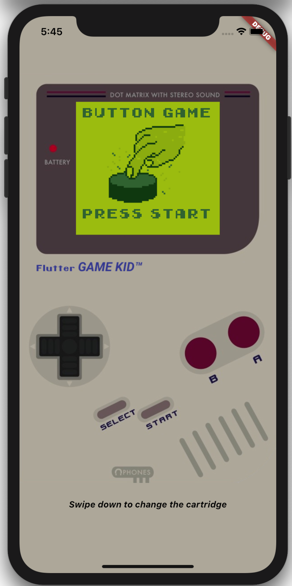
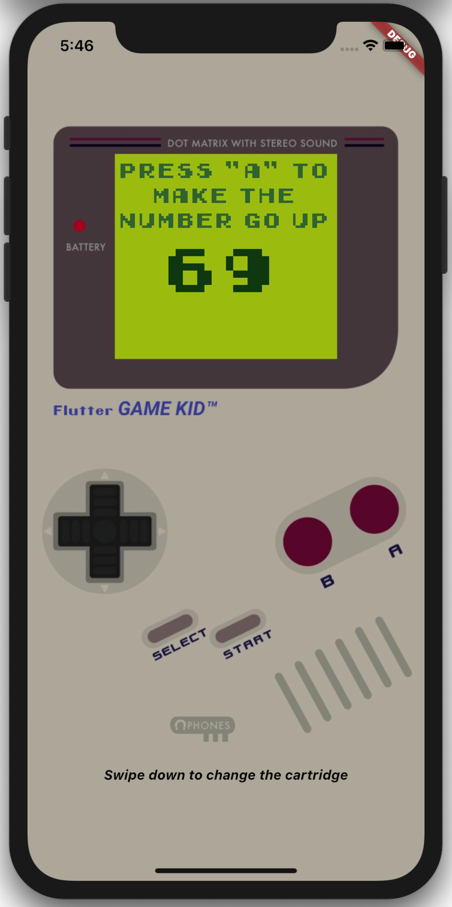
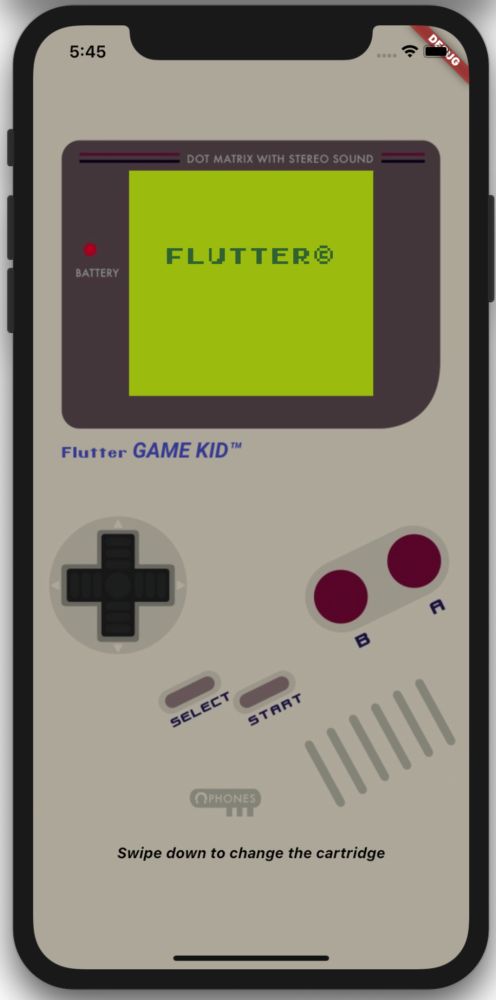
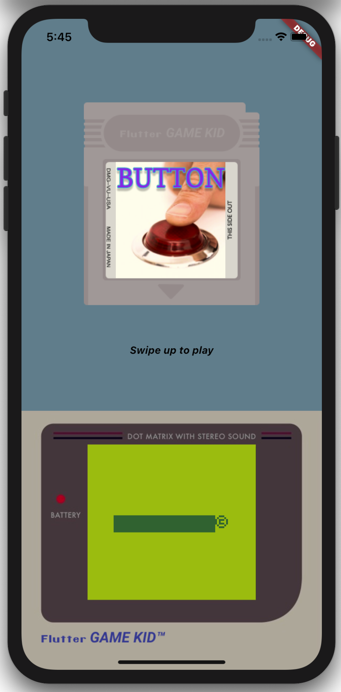

# Flutter Game Kid: 

GameBoy Recreated with Flutter for Hack20 Hackaton

 
It's not possible to embed videos directly, but you can put an image which links to a YouTube video:

## Featured

- 1 Game Included: The award winning title "Button"
- You can play the game
- Remove the cartridge
- Put it back in

## Sponsors

- Qvik (We are hiring) [qvik.com](https://qvik.com)

## Tools Used

- Flutter (duh)
- Audacity
- Aseprite

## Credits & Assets Used

- [Gameboy Image](https://www.behance.net/gallery/10354685/NINTENDO-GAMEBOY-VECTOR-ILLUSTRATIONS)
- [Freesound - “Button 04.wav” by JarredGibb](https://freesound.org/people/JarredGibb/sounds/219477/)
- [Freesound - “Button 01.wav” by JarredGibb](https://freesound.org/people/JarredGibb/sounds/219472/)
- [Freesound - “gameboy pluck.wav” by neezen.](https://freesound.org/people/neezen./sounds/503469/)
- [Gameboy Startup Sound - YouTube](https://www.youtube.com/watch?v=3bCT3YxZfAY&feature=youtu.be)
- [Game Boy Original Colour Palette (Hex and RGB) - Design Pieces](https://www.designpieces.com/palette/game-boy-original-color-palette-hex-and-rgb/)
- https://freesound.org/people/plasterbrain/sounds/243020/
- [Gameboy Game Cartridge – Hand Drawn Vector | ☢ Utter Pandamonium ☢](https://utterpandamonium.wordpress.com/2012/08/03/gameboy-game-cartridge-hand-drawn-vector/)

## Screenshots

## About Flutter Stuff

This project is a starting point for a Flutter application.

A few resources to get you started if this is your first Flutter project:

- [Lab: Write your first Flutter app](https://flutter.dev/docs/get-started/codelab)
- [Cookbook: Useful Flutter samples](https://flutter.dev/docs/cookbook)

For help getting started with Flutter, view our
[online documentation](https://flutter.dev/docs), which offers tutorials,
samples, guidance on mobile development, and a full API reference.
